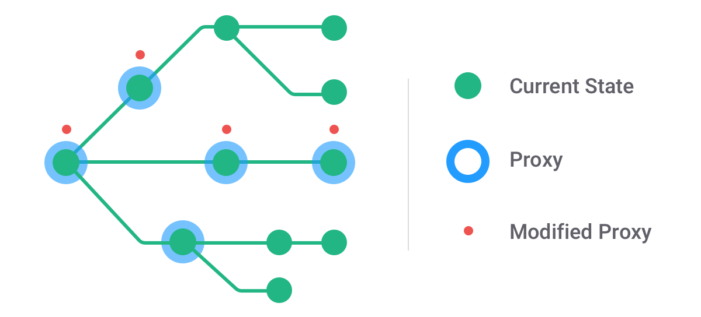

---

layout: yandex2

style: |
    /* собственные стили можно писать здесь!! */

    .title_s h2 {
        font-size: 90px !important;
    }

    .title_xs h2 {
        font-size: 75px !important;
    }

    .center p {
        display: flex;
        align-items: center;
        justify-content: center;
        margin-bottom: 100px;
    }

    .meme img {
        width: 700px;
    }

    .image_full img {
        width: 100%;
    }

    .wtf img {
        width: 1000px;
    }

    .title h3 img {
        display: none;
    }

    .title h2 {
        width: 800px;
    }

    .title {
        background-image: url(/shri-js/pictures/young-and-yandex.jpg);
        background-size: contain;
    }
---

# {:.logo}

## {{ site.presentation.title }}
{:.title.title_s}

### {{ site.presentation.service }}



{:.nda}


<div class="authors">


<p>{{ site.author.name }}, {{ site.author.position }}</p>



<p>{{ site.author2.name }}, {{ site.author2.position }}</p>


</div>

<!-- Начало презентации -->

## Функциональное программирование?
{:.images .two .meme}


{:.next}


{:.next}

## Дверь в новый мир
{:.fullscreen}


<figure>
Дверь в новый мир
</figure>
{:style="width: 600px;"}

## Штука интересная, но...
{:.image .center .meme}


{:.next}

## λ-исчисление
{:.fullscreen}


<figure>
λ-исчисление
</figure>
{:style="width: 500px;"}

## JavaScript
{:.fullscreen}


<figure>
JavaScript
</figure>
{:style="width: 400px;"}

## Коалы тоже грустят
{:.fullscreen}


<figure>
Коалы тоже грустят
</figure>
{:style="width: 600px;"}

## Добавить функционального света
{:.fullscreen}


<figure>
Добавить функционального света
</figure>
{:style="width: 950px;"}

## Задача функционального программирования

- ...Сделать код <b>понятнее</b>
- ...Понимание — это <b>доверие</b>

## Мы работаем в команде
{:.fullscreen}


<figure>
Мы работаем в команде
</figure>
{:style="width: 700px;"}

## Смотреть на звезды
{:.fullscreen}


<figure>
Смотреть на звезды
</figure>
{:style="width: 650px;"}

## Но есть один пустяк...
{:.section}
### Итак, вы решили изучить функциональное программирование
## Первый раз за рулем
{:.fullscreen}


<figure>
Первый раз за рулем
</figure>
{:style="width: 650px;"}

## Уже опытный водитель
{:.fullscreen}


<figure>
Уже опытный водитель
</figure>
{:style="width: 700px;"}

## Похожие технологии изучать проще
{:.fullscreen}


<figure>
Похожие технологии изучать проще
</figure>
{:style="width: 1000px;"}

## Здесь все по другому
{:.fullscreen}


<figure>
Здесь все по другому
</figure>
{:style="width: 650px;"}


## И начать с начала...
{:.section}

### Забыть все, что знали раньше

## <b>Терминология</b>
{:.section}

## Императивный vs Декларативный

```js
const array = [4, 8, 15, null, 23, undefined]
```
{:.next}

```js
// императивный подход
const imperative = []
for (let i = 0, len = array.length; i < len; ++i) {
    if (array[i]) {
        imperative.push(array[i])
    }
}
```
{:.next}

```js
// декларативный подход
const declarative = array.filter(Boolean)
```
{:.next}

## Примеры декларативных языков

```css
/* css */
.button {
    color: azure;
}
```
{:.next}

```sql
-- SQL
SELECT title
FROM films
WHERE rating > 9
GROUP BY director
```
{:.next}

## Функции и Процедуры

- ...<b>Функция</b> — возвращает значение
- ...<b>Процедура</b> — вызывается ради побочных эффектов

```js
// функция
const f = (x) => x * Math.sin(1 / x)
```
{:.next}

```js
// процедура
const print = (...args) => {
    const style = 'color: orange;'
    console.log('%c' + args.join('\n'), style)
}
```
{:.next}

## Параметры и аргументы

- ...<b>Параметры</b> — переменные в объявлении функции
- ...<b>Аргументы</b> — конкретные значения, переданные при вызове

```js
// x — параметр (почти любое число)
const f = (x) => x * Math.sin(1 / x)
```
{:.next}

```js
// 0.17 — аргумент (конкретное число)
f(0.17)
```
{:.next}

## Сигнатура

- ...Количество, тип и порядок параметров

```js
/**
 * @param {*} value
 * @param {Function|Array<string>|null} [replacer]
 * @param {number|string|null} [space]
 * @returns {string}
 */
function toJSON (value, replacer, space) {
    return JSON.stringify(value, replacer, space)
}
```
{:.next}

## Арность

- ...Количество параметров

```js
const awesome = (good, better, theBest) => {}
awesome.length // 3
```
{:.next}

```js
const defaultParams = (answer = 42) => {}
defaultParams.length // 0
```
{:.next}

```js
const restParams = (...args) => {}
restParams.length // 0
```
{:.next}

```js
const destructuring = ({target}) => {}
destructuring.length // 1
```
{:.next}

## Рекурсия

```js
// функция вызывает сама себя
function factorial (n) {
    if (n <= 1) { return 1 }
    return n * factorial(n - 1)
}
```
{:.next}

```js
// хвостовая рекурсия
function factorial (n, total = 1) {
    if (n <= 1) { return total }
    return factorial(n - 1, n * total)
}
```
{:.next}

## Функции первого класса

- ...Ведут себя как <b>переменные</b>, т.е. их можно...

```js
// присваивать
const assign = () => {}
```
{:.next}

```js
// передавать
const passFn = (fn) => fn()
```
{:.next}

```js
// возвращать
const returnFn = () => () => {}
```
{:.next}

## Функции высшего порядка

- ...<b>Принимают</b> или <b>возвращают</b> другие функции

```js
// map, filter, reduce и т.д.
[0, NaN, Infinity].filter(Boolean)
```
{:.next}

```js
// обещание
new Promise((res) => setTimeout(res, 300))
```
{:.next}

```js
// обработчик событий
document.addEventListener('keydown', ({code, key}) => {
    console.log(code, key)
})
```
{:.next}

## Предикат

- ...Функция, которая возвращает <b>логическое</b> значение

```js
const array = [4, 8, 15, 16, 23, 42]

// isEven — это предикат
const isEven = (x) => x % 2 === 0
const even = array.filter(isEven)
```
{:.next}

## Замыкание

- ...Функция + область видимости

```js
const createCounter = tag => count => ({
    inc () { ++count },
    dec () { --count },
    val () {
        console.log(`${tag}: ${count}`)
    }
})

const pomoCounter = createCounter('🍅')
```
{:.next style="float:left;"}

```js
const work = pomoCounter(0)
work.inc()
work.val() // 🍅: 1

const rest = pomoCounter(4)
rest.dec()
rest.val() // 🍅: 3
```
{:.next.image-right style="width: 700px;"}

## Мемоизация — функция с памятью

```js
const memo = (fn, cache = new Map) => param => {
    if (!cache.has(param)) {
        cache.set(param, fn(param))
    }
    return cache.get(param)
}
```
{:.next}

```js
const f = memo((x) => x * Math.sin(1 / x))
```
{:.next}

```js
f(0.314) // вычислить
f(0.314) // взять из кеша
```
{:.next}


## Приключение начинается...
{:.section}

### Погружение в мир функционального программирования

## <b>Конвейер и композиция</b>
{:.section#pipe-and-compose}

### Pipe and Compose

## Конвейерный оператор

```bash
# вывести идентификаторы процессов с подстрокой «kernel»
ps aux | grep 'kernel' | awk '{ print $2 }'
```
{:.next}

```js
const double = (n) => n * 2
const increment = (n) => n + 1
```
{:.next}

```js
// без конвейерного оператора
double(increment(double(double(5)))) // 42
```
{:.next}

```js
// с конвейерным оператором
5 |> double |> double |> increment |> double // 42
```
{:.next}
## Конвейер

```js
// исходная последовательность
double(increment(double(double(5)))) // 42
```
{:.next}

```js
pipe(double, double, increment, double)(5) // 42
```
{:.next}

```js
// 5 -> 10 -> 20 -> 21 -> 42
```
{:.next}

## Композиция

```js
// композиция функций в чистом виде
double(increment(double(double(5)))) // 42
```
{:.next}

```js
compose(double, increment, double, double)(5)
```
{:.next}

```js
// 42 <- 21 <- 20 <- 10 <- 5
```
{:.next}

## В чём разница?

```js
// оригинальная цепочка вызовов
three(two(one(x)))
```
{:.next}

```js
// более естественно с точки зрения чтения
pipe(one, two, three)(x)
```
{:.next}

```js
// более естественно с точки зрения записи
compose(three, two, one)(x)
```
{:.next}


```js
// На самом деле, все немножко сложнее... 🤓
```
{:.next}

## -
{:.fullscreen}


<figure>
Функции — это кубики Lego
</figure>

## Функции — это кубики Lego

```js
// готовые кубики
const words = str => str.toLowerCase().match(/[а-яё]+/g)
const unique = iter => [...new Set(iter)]
```
{:.next}

```js
const text = `Съешь ещё этих мягких
французских булок, да выпей же чаю`
```
{:.next}

```js
const foundWords = words(text)
const uniqueWords = unique(foundWords)
```
{:.next}

## -
{:.fullscreen}


<figure>
Полезная деталь
</figure>
{:style="width: 600px;"}

## Создание новой детали

```js
// создать новую деталь из готовых кубиков
function getUniqueWords (text) {
    return unique(words(text))
}
```
{:.next}

```js
const uniqueWords = getUniqueWords(text)
```
{:.next}

## Композиция спешит на помощь

```js
// создать новую деталь через композицию
const getUniqueWords = compose(unique, words)
```
{:.next}

```js
const uniqueWords = getUniqueWords(text)
```
{:.next}

## Добавить еще один кубик


```js
// еще один готовый кубик
const sort = iter => [...iter].sort()
```
{:.next}

```js
// новая деталь, которая пригодится для новых построек
const getSortedUniqueWords = compose(sort, getUniqueWords)
```
{:.next}

```js
// вложенная композиция
compose(sort, compose(unique, words))
```
{:.next}

```js
// линейная композиция
compose(sort, unique, words)
```
{:.next}

## Бесточечный стиль

```js
// стиль с параметрами
function getUniqueWords (text) {
    return unique(words(text))
}
```
{:.next}

```js
// стиль без параметров (бесточечный стиль)
const getUniqueWords = compose(unique, words)
```
{:.next}

## Композиция в Redux

```js
const store = createStore(
    reducer,
    compose(
        applyMiddleware(...middleware),
        DevTools.instrument(),
    )
)
```
{:.next}

## Фильтрация или преобразование данных

```js
notifications.filter((notification) => {
    // ...проверить все условия
})
```
{:.next}

```js
notifications
    .filter(isOpen)
    .filter(isLang)
```
{:.next}

```js
notifications.filter(compose(
    isLang,
    isOpen,
))
```
{:.next}

## Пишем сами

```js
function pipe (...fns) {
    return (x) => fns.reduce((v, f) => f(v), x)
}
```
{:.next}

```js
function compose (...fns) {
    return (x) => fns.reduceRight((v, f) => f(v), x)
}
```
{:.next}

## Ограничения

```js
const translate => (lang, text) => magicSyncApi(lang, text)
```
{:.next}

```js
const getTranslatedWords = compose(translate, unique, words)
```
{:.next}

```js
getTranslatedWords(text) // 💥 упс... что-то сломалось
```
{:.next}

## Как так?!
{:.wtf}


## Продолжение следует...
{:.section}

### Конец эпизода про конвеер и композицию

## <b>Частичное применение</b><br><b>Каррирование</b>
{:.section#partial-application-and-currying}

### Partial application and Currying


## В предыдущих сериях

```js
const translate => (lang, text) => magicSyncApi(lang, text)
```

```js
const getTranslatedWords = compose(translate, unique, words)
```

```js
getTranslatedWords(text) // 💥 упс... что-то сломалось
```

## Modern Software Development

<video width="1024" controls id="adapter">
  <source src="pictures/adapter.mp4" type="video/mp4">
</video>

<script defer>
    window.onload = () => {
        document.getElementById('adapter').playbackRate = 2.0;
    }
</script>

## Частичное применение

...Преобразует функцию в <b>одну функцию</b> с меньшим числом параметров

```js
const sum = (x, y, z) =>
    console.log(x + y + z)
```
{:.next}

```js
const partialSum = partial(sum, 8)
partialSum(13, 21) // 42
```
{:.next}

## Каррирование

...Преобразует функцию в <b>набор функций</b> с единственным параметром

```js
const sum = (x, y, z) =>
    console.log(x + y + z)
```
{:.next}

```js
const curriedSum = curry(sum)
curriedSum(8)(13)(21) // 42
```
{:.next}


```js
// на практике допустимы несколько аргументов за раз
curriedSum(8, 13)(21) // 42
curriedSum(8, 13, 21) // 42
```
{:.next}


## В чём разница?

```js
const partialSum = partial(sum, 42)
partialSum() // NaN, потому что 42 + undefined + undefined
```
{:.next}

```js
const curriedSum = curry(sum)
curriedSum(8) // новая функция — sum(8)
curriedSum(8)(13) // ещё одна новая функция — sum(8, 13)
curriedSum(8)(13)(21) // 42, потому что набралось нужное число аргументов
```
{:.next}

## Решение проблемы с композицией

```js
const translate => (lang, text) => magicSyncApi(lang, text)
```
{:.next}

```js
// через частичное применение
const english = partial(translate, 'en')
```
{:.next}

```js
// через каррирование
const english = curry(translate)('en')
```
{:.next}

```js
// создать новую деталь с возможностью перевода
const getTranslatedWords = compose(english, unique, words)

getTranslatedWords(text) // теперь всё работает
```
{:.next}

## Порядок данных


```js
// сперва итерация, затем данные (iterate-first, data-last)
const translate => (lang, text) => /* */
```
{:.next}

```js
// сперва данные, затем итерация (data-first, iterate-last)
const translate => (text, lang) => /* */
```
{:.next}

```js
function flip (fn) {
    return (...args) => fn(...args.reverse())
}
```
{:.next}

```js
const curryRight = compose(curry, flip)
const partialRight = compose(partial, flip)
```
{:.next}

## Специализация

```js
const fetchApi = (baseUrl, path) =>
    fetch(`${baseUrl}${path}`)
        .then(res => res.json())
```
{:.next}

```js
// каррирование
const fetchCurry = curry(fetchApi)
const fetchUnsplash = fetchCurry('https://api.unsplash.com')
const fetchRandomPhoto = fetchUnsplash(fetchApi, '/photos/random')
```
{:.next}

```js
// частичное применение
const fetchUnsplash = partial(fetchApi, 'https://api.unsplash.com')
const fetchRandomPhoto = partial(fetchUnsplash, '/photos/random')
```
{:.next}

## Как на практике?

```js
const fetchUnsplash = fetchApi.bind(null, 'https://api.unsplash.com')
const fetchRandomPhoto = fetchUnsplash.bind(null, '/photos/random')
```
{:.next}


## Пишем сами

```js
function partial (fn, ...apply) {
    return (...args) => fn(...apply, ...args)
}
```
{:.next}

```js
function curry (fn) {
    return (...args) => args.length >= fn.length ?
        fn(...args) : curry(fn.bind(null, ...args))
}
```
{:.next}

## Если у вас все еще нет изоленты
{:.image_full}


{:.next}

## Грозовые тучи побочных эффектов
{:.fullscreen}


<figure>
Грозовые тучи побочных эффектов
</figure>
{:style="width: 1000px;"}

## Продолжение следует...
{:.section}

### Конец эпизода про частичное применение и каррирование

## <b>Неизменяемость</b>
{:.section#immutability}

### Immutability

## Изменяемый стакан

```js
const takeGlass = (volume) => ({
    look () { console.log(volume) },
    drink (amount) {
        volume = Math.max(volume - amount, 0)
        return this
    }
})

const mutable = takeGlass(100)
```
{:.next}

```js
mutable.drink(20).drink(30).look() // 50
mutable.look() // 50
```
{:.next}

## Неизменяемый стакан

```js
const takeGlass = (volume) => ({
    look () { console.log(volume) },
    drink (amount) {
        return takeGlass(Math.max(volume - amount, 0))
    }
})

const immutable = takeGlass(100)
```

```js
immutable.drink(20).drink(30).look() // 50
immutable.look() // 100 😮
```
{:.next}

## Преимущества неизменяемых данных

- ...предсказуемое изменение состояния
- ...быстрое сравнение по ссылке
- ...кешируемость
- ...легко распараллеливать
- ...легко тестировать

...Но есть один пустяк 🥺
- ...надо помнить, что надо копировать
- ...затраты на копирование

## Изменчивый JavaScript
{:.section}

## Нечаянное мутирование данных

```js
function sortArray (array) {
    return array.sort()
}
```
{:.next}

```js
const fruits = ['orange', 'pineapple', 'apple']
const sorted = sortArray(fruits)
```
{:.next}

```js
// упс... исходный массив тоже изменился
console.log(fruits) // ['apple', 'orange', 'pineapple']
console.log(sorted) // ['apple', 'orange', 'pineapple']
```
{:.next}

## const защищает только ссылку

```js
const object = {}
```
{:.next}

```js
// const означает константную ссылку
object = {} // TypeError: Assignment to constant variable
```
{:.next}

```js
// но сам объект можно беспрепятственно изменять
object.value = 42 // мутация объекта
```
{:.next}

## Передача по ссылке

```js
const array = []
```
{:.next}

```js
// копия ссылки
const ref = array
ref.push('apple')
```
{:.next}

```js
// ещё одна копия ссылки
const append = (ref) => { ref.push('orange') }
append(array)
```
{:.next}

```js
// массив дважды мутирован через ссылку
console.log(array) // [ 'apple', 'orange' ]
```
{:.next}

## Поможет ли заморозка?

```js
const object = { val: 23, ref: {} }
const frozen = Object.freeze(object)
```
{:.next}

```js
// игнорирование ошибки без 'use strict'
// или же TypeError: Cannot assign to read only property...
frozen.val = 42
```
{:.next}

```js
// мутирование вложенных данных по ссылке
frozen.ref.boom = '💥'
```
{:.next}

```js
console.log(frozen) // { val: 23, ref: { boom: '💥' }
```
{:.next}

## Поможет ли Proxy API?

```js
const object = { val: 23, ref: {} }
const proxy = new Proxy(object, {
    set () { return true },
    deleteProperty () { return true }
})
```
{:.next}

```js
// добавление, изменение или удаление свойства будет отклонено
proxy.val = 42
```
{:.next}

```js
// но вложенные объекты всё ещё мутабельны
proxy.object.boom = '💥'
```
{:.next}

```js
console.log(proxy) // { val: 23, ref: { boom: '💥' } }
```
{:.next}

## Копирование данных
{:.section}

## Копирование встроенными средствами

```js
const array = [4, 8, 15, 16, 23]
const object = { val: 42 }
```
{:.next}

```js
// создать новый объект или массив
[].concat(array)
Object.assign({}, object)
```
{:.next}

```js
// но через деструктуризацию удобнее
[ ......array ]
{ ......object }
```
{:.next}

## Поверхностная копия

```js
const object = { val: 23, ref: {} }
const copy = { ......object }
```
{:.next}

```js
copy.val = 42
copy.ref.boom = '💥'
```
{:.next}

```js
console.log(object) // { val: 23, ref: { boom: '💥' }
```
{:.next}

## Функциональные методы

```js
const array = [null, 23, {}]
const copy = array.filter(Boolean)
```
{:.next}

```js
copy[0] = 42
copy[1].boom = '💥'
```
{:.next}

```js
console.log(array) // [ null, 23, { boom: '💥' } ]
console.log(copy) // [ 42, { boom: '💥' }
```
{:.next}

## Требуется<br>глубокая копия 😔
{:.blockquote}

### [What is the most efficient way to deep clone?](https://stackoverflow.com/a/122704)
{:.next}

## structuredClone


```js
const object = { val: 23, ref: {} }
const copy = structuredClone(object)
```
{:.next}

```js
copy.val = 42
copy.ref.boom = '💥'
```
{:.next}

```js
console.log(object) // { val: 23, ref: {} } ☺️
```
{:.next}

### ...[Deep Cloning Objects in JavaScript, the Modern Way](https://www.builder.io/blog/structured-clone)

## Неизменяемые структуры данных ❤️



### [Introducing Immer: Immutability the easy way](https://medium.com/hackernoon/introducing-immer-immutability-the-easy-way-9d73d8f71cb3)


## Immer в действии

```js
import produce from 'immer';
```
{:.next}

```js
const object = { ref: { data: {} } };
const immutable = produce(object, (draft) => {
    draft.ref.boom = '💥';
});
```
{:.next}

```js
console.log(object) // { ref: { data: {} }
console.log(immutable) // { ref: { data: {}, boom: '💥' }
```
{:.next}

```js
// оптимизация через копирование при записи
// копия data не создавалась, т.к. объект не изменялся
console.log(object.ref.data === immutable.ref.data) // true
```
{:.next}

## Редьюсер через деструктуризацию

```js
const addTodo = (state = initState, action) => {
    switch (action.type) {
        case ADD_TODO: {
            return {
                ...state,
                todos: [...state.todos, action.todo]
            }
        }
        default: {
            return state;
        }
    }
}
```
{:.next}

## Редьюсер через Immer

```js
import produce from 'immer'

const addTodo = (state = initState, action) =>
    produce(state, draft => {
        switch (action.type) {
            case ADD_TODO: {
                draft.todos.push(action.todo)
                break
            }
        }
    })
```
{:.next}

## Нужен новый герой
{:.fullscreen}


<figure>
Нужен новый герой
</figure>
{:style="width: 650px;"}

## Продолжение следует...
{:.section}

### Конец эпизода про неизменяемость

## <b>Чистые функции</b>
{:.section#pure-functions}

### Pure functions


## Чистая функция

Это функция...

- ...без <b>побочных эффектов</b>
- ...которая зависит <b>только от параметров</b>
- ...и для одних и тех же аргументов<br>всегда возвращает <b>один и тот же результат</b>

## Побочные эффекты (side effects)

- ...взаимодействие с внешним миром через операции ввода/вывода
- ...изменение глобальных переменных
- ...мутация данных

## Взаимодействие с внешним миром

```js
function impure () {
    // логирование
    console.log('side effects')
    // запись в файл
    fs.writeFileSync('log.txt', `${new Date}\n`, 'utf8')
    // запрос на сервер и т. д.
    fetch('/analytics/pixel')
}
```
{:.next}

## Глобальные переменные

```js
function impure () {
    // глобальная переменная
    app.state.hasError = true
}
```
{:.next}

## Мутация данных

```js
function impure (o) {
    return Object.defineProperty(o, 'mark', {
        value: true,
        enumerable: true,
    })
}
```
{:.next}

```js
const object = {}
const marked = impure(object)
```
{:.next}

```js
// defineProperty мутировала исходный объект
console.log(object) // { mark: true }
```
{:.next}

## Фронтенд — это сплошной side effect 😅

```js
function impure () {
    // модификация DOM
    document.getElementById('menu').hidden = true
    // установка обработчика
    window.addEventListener('scroll', () => {})
    // запись в локальное хранилище
    localStorage.setItem('status', 'ok')
}
```
{:.next}

## Зависимость от параметров

```js
function impure () {
    // глобальная переменная
    if (NODE_ENV === 'development') { /* */ }
    // чтение данных из DOM
    const { value } = document.querySelector('.email')
    // обращение к локальному хранилищу
    const id = localStorage.getItem('sessionId')
    // чтение из файла и т. д.
    const text = fs.readFileSync('file.txt', 'utf8')
}
```
{:.next}

## Непредсказуемый результат

```js
function impure (min, max) {
    return Math.floor(Math.random() * (max - min + 1) + min)
}
```
{:.next}

```js
impure(1, 10) // 4
impure(1, 10) // 2
```
{:.next}

```js
function pure (min, max, random = Math.random()) {
    return Math.floor(random * (max - min + 1) + min)
}
```
{:.next}

```js
pure(1, 10, 0.42) // 5
pure(1, 10, 0.42) // 5
```
{:.next}

## Преимущества чистых функций

- ...проще разобраться, как устроена функция
- ...их можно запросто кешировать
- ...легко тестировать
- ...легко распараллеливать
- ...обладают ссылочной прозрачностью

## Ссылочная прозрачность

```js
const refTransparency = () =>
    Math.pow(2, 5) + Math.sqrt(100)
```
{:.next}

```js
// вызов функции
refTransparency()
```
{:.next}

```js
// можно раскрыть
Math.pow(2, 5) + Math.sqrt(100)
```
{:.next}

```js
// и без особых трудностей понять результат
32 + 10 // 42
```
{:.next}

## Абсолютная и относительная чистота

```js
(() => {})() // абсолютная чистота
```
{:.next}

```js
// побочные эффекты выносятся за пределы
const text = fs.readFileSync('file.txt', 'utf8')

// функция получает нужные данные только через параметры
function pure (text) { /* чистота */ }
```
{:.next}

```js
// pure или impure?
function circleArea (radius) {
    return Math.PI * (radius ** 2)
}
```
{:.next}


## Финал
{:.section}

### Приключение подходит к своему завершению...


## Быстрое погружение
{:.fullscreen}


<figure>
Быстрое погружение
</figure>
{:style="width: 650px;"}

## Ключ, чтобы продолжить путешествие
{:.fullscreen}


<figure>
Ключ, чтобы продолжить путешествие
</figure>
{:style="width: 1050px;"}


## Что еще почитать по теме?

- ...[Жаргон функционального программирования](https://habr.com/ru/post/310172/)
- ...[Functional-Light JavaScript](https://github.com/getify/Functional-Light-JS#functional-light-javascript)
- ...[Mostly adequate guide to Functional Programming](https://github.com/MostlyAdequate/mostly-adequate-guide-ru)
- ...[Awesome FP JS](https://github.com/stoeffel/awesome-fp-js)
- ...Попробуйте [Ramda](https://ramdajs.com/) или [Elm](https://elm-lang.org/)

### [Шпаргалка по функциональному программированию](https://habr.com/ru/company/yandex/blog/547786/)
{:.next}

## Вместо заключения
{:.section}

### Мы поняли, кое-что важное...

## Каррируйте, композируйте, очищайте 👏
{:.section .title_xs}

<!-- ## Контакты
{:.contacts}



<figure markdown="1">

### {{ site.author.name }}


{{ site.author.position }}


</figure>





<figure markdown="1">

### {{ site.author2.name }}


{{ site.author2.position }}


</figure>

 -->

<!-- разделитель контактов -->
<!-- ------- -->

<!-- left -->
<!-- - {:.skype}author -->
<!-- - {:.mail}author@yandex-team.ru -->
<!-- - {:.github}author -->

<!-- right -->
<!-- - {:.twitter}@author -->
<!-- - {:.facebook}author -->
<!-- - {:.telegram}@author -->

<!--

- {:.mail}author@yandex-team.ru
- {:.phone}+7-999-888-7766
- {:.github}author
- {:.bitbucket}author
- {:.twitter}@author
- {:.telegram}author
- {:.skype}author
- {:.instagram}author
- {:.facebook}author
- {:.vk}@author
- {:.ok}@author

-->
